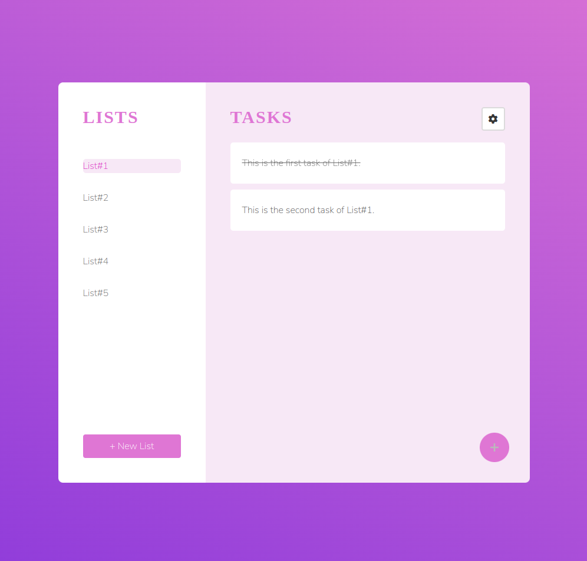
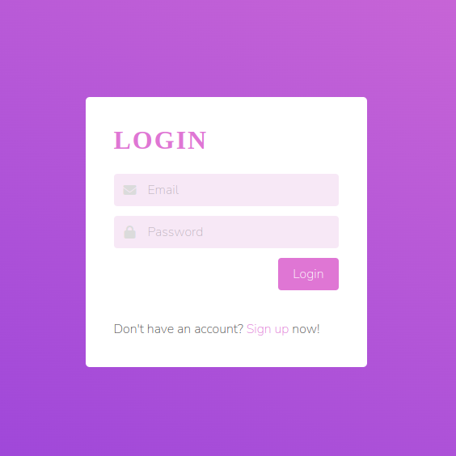

# TaskGenie

<p float="left">
  
</p>

TaskGenie is your magical solution for effective task management and productivity enhancement. This user-friendly web app empowers you to regulate your daily routine, keep track of your tasks, and maintain discipline while adding a touch of enchantment to your day.
<p>
 
 </p>


## Features

- **User Authentication**: Keep task data private with secure login/signup and logout functionality.

- **List Management**:  Create, edit, and delete lists, tailoring your workspace to your needs.

- **Task Management**: Easily track, create, edit, and delete tasks within custom lists.

- **Task Completion**: Celebrate achievements by marking tasks as complete.

  
## Installation

Prerequisites
----------------

        - Node.js
        - NPM
        - Angular CLI 
        - MongoDB
        - Use nvm install 8 & nvm use 8

To Setup
---------- 

1. Clone this repository Or Download this repository:

   ```bash
   git clone https://github.com/Srishti-j18/TaskGenie.git

3. Navigate to the frontend project directory:

   ```bash
   cd TaskGenie/frontend
   
4. Install the required dependencies:

   ```bash
   npm install

5. Navigate to the backend project directory:

   ```bash
   cd TaskGenie/api

6. Install the required dependencies:

   ```bash
   npm install

7. Run the node-server:
   ```bash
   cd TaskGenie/api
   nodemon app.js

8. Run the angular frontend (in another terminal):

   ```bash
   cd TaskGenie/frontend
   ng serve
   
9. Open your web browser and navigate to `http://localhost:4200/`to access TaskGenie.

## Usage

TaskGenie makes it easy to maintain discipline and achieve your goals. Create lists, add tasks, track your progress, and stay organized with a touch of magic.

##  Bug Reporting

Feel free to [open an issue](https://github.com/Srishti-j18/TaskGenie/issues) on GitHub if you find any bugs.


##  Feature Request

- Feel free to [Open an issue](https://github.com/Srishti-j18/TaskGenie/issues) on GitHub to request any additional features you might need for your use case.
- Connect with me on [LinkedIn](https://www.linkedin.com/in/srishti-jaiswal18/). I'd love️ to hear where you are using this library.

   

   


   


